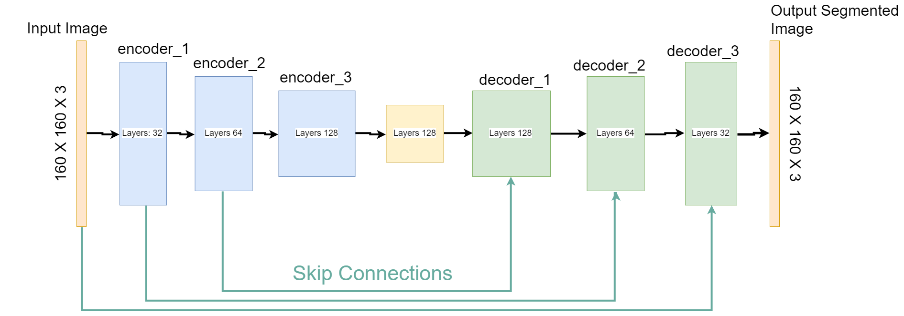
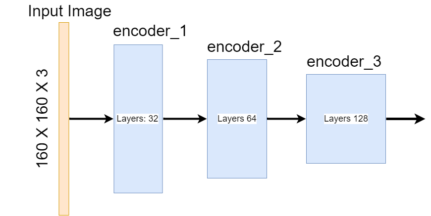
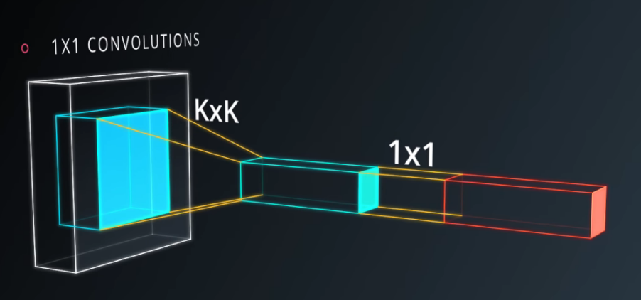
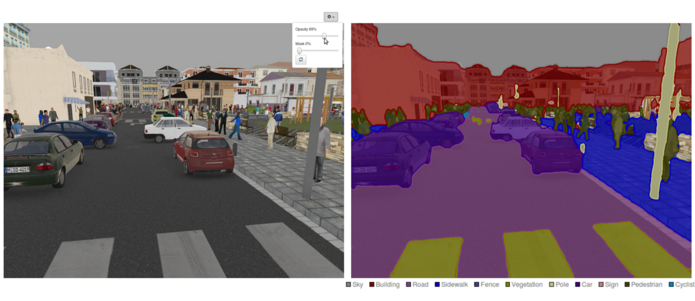
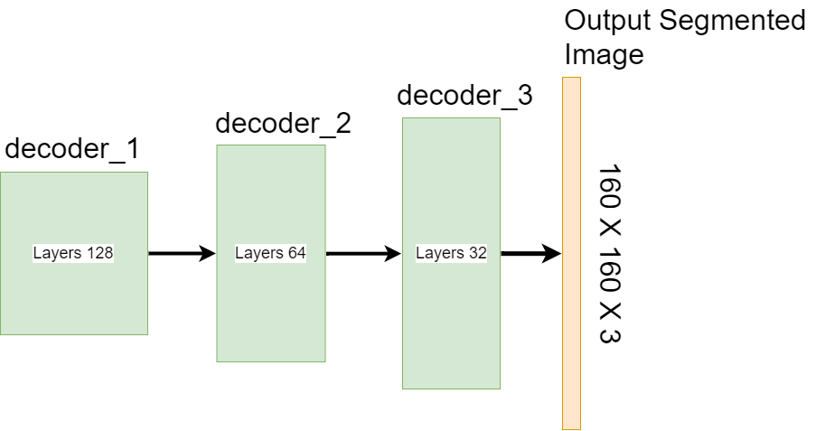
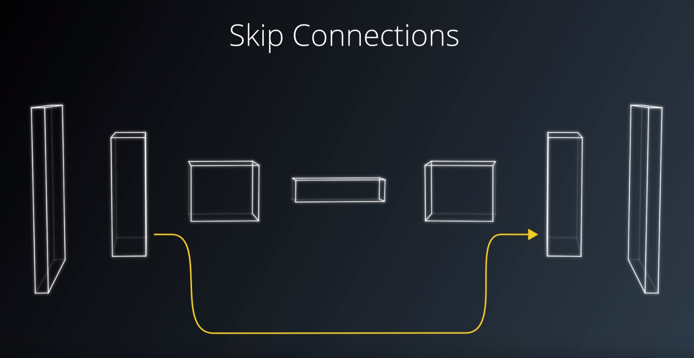
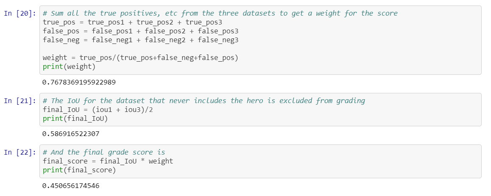

>   ## Project: Follow Me
>
>   >   **Date:** August 21, 2018
>   >
>   >   **By:** Paul Griz
>   >
>   >   Project Submission for the Udacity Robotics Software Engineer Nanodegree

[](https://www.udacity.com/robotics)

---

Convolutional Neural Networks (CNN) output fully connected layers for classification. Their output dimensions are flattened into a single vector and loose spatial information during classification. So, any model built with a CNN would not be able to accomplish this project's goal. The solution to achieving classification and maintaining spatial information is a Fully Convolutional Neural Network (FCN).

FCNs differ from CNNs in their ability to retain spatial information and classify every pixel in an image. There are the three architectural changes between a FCN and a CNN:

1.  1x1 Convolutional Layers replace the CNN's fully connected layers.
2.  Convolutional layers are transposed to up-sample the image.
3.  Skip Connections are added.

This project utilizes a fully convolutional network model that is able to segment objects for identifying a simulated target person from the input of a drone's camera. The goal of this project was to successfully build and train this model to follow the target person. 

The model was built using [Tensorflow](https://www.tensorflow.org/tutorials/) and [Keras](https://keras.io/) and trained on an AWS EC2 [P2.xlarge](https://aws.amazon.com/ec2/instance-types/p2/) instance. 

Overall, the final architecture is comprised of:

1.  Three Layered Encoder Block
2.  One 1x1 Convolutional Layer 
3.  Three Layered Decoder Block

```python
def fcn_model(inputs, num_classes):
    # Encoder Blocks
    encoder_1 = encoder_block(inputs, filters=32, strides=2)
    encoder_2 = encoder_block(encoder_1, filters=64, strides=2)
    encoder_3 = encoder_block(encoder_2, filters=128, strides=2)

    # 1x1 Convolution layer
    conv_1x1 = conv2d_batchnorm(encoder_3, filters=128, kernel_size=1, strides=1)
    
    # Decoder Blocks
    decoder_1 = decoder_block(small_ip_layer=conv_1x1, large_ip_layer=encoder_2, filters=128)
    decoder_2 = decoder_block(small_ip_layer=decoder_1, large_ip_layer=encoder_1, filters=64)
    decoder_3 = decoder_block(small_ip_layer=decoder_2, large_ip_layer=inputs, filters=32)
    
    # The output layer of your model
    return layers.Conv2D(num_classes, 1, activation='softmax', padding='same')(decoder_3)
```

The model's architecture is diagramed below.

|  |
| :---------------------------: |
|  Model Architecture Diagram   |

---

## Encoder Block

The Encoder Block is comprised of a series of separable convolutions, also known as depthwise separable convolutions. In a separable convolution, the kernel operation is split into multiple steps which reduces the number of parameters needed. This increases the efficiency for the encoder network.

Each layer in the encoder block decreases the input image's resolution and increases number of the filters maps (the depth). The end effect forces the FCN to find generic representations of the data which reduces overfitting.

|  |
| :-----------------------------: |
|      Encoder Block Diagram      |

Each layer in the encoding block was built using the `encoder_block()` function:

```python
def encoder_block(input_layer, filters, strides):
    return separable_conv2d_batchnorm(input_layer, filters, strides=strides)
```

Which calls the `separable_conv2d_batchnorm()` function:

```python
def separable_conv2d_batchnorm(input_layer, filters, strides=1):
    output_layer = SeparableConv2DKeras(filters=filters,
                                        kernel_size=3,
                                        strides=strides,
                                        padding='same',
                                        activation='relu')(input_layer)
    return layers.BatchNormalization()(output_layer)
```

The output of  encoder's last layer is sent to a 1x1 convolutional layer. 

#### 1x1 Convolution

A 1x1 Convolutional Layer connects the encoder block with the decoder block. This convolutional layer computes a pixel by pixel classification for semantic representation of the feature maps output of the encoder. 

|            |
| :---------------------------------------: |
| 1x1 Convolutional Layer - Credit: Udacity |

A 1x1 convolutional layer's structure is comprised of:

-   1x1 filter size
-   kernel_size=1
-   Strides=1
-   Padding=SAME
-   An input filter number

This results in the a matrix multiplication operation that preserves spatial information. Regarding classification, fully connected layers are ideally the best way to accomplish the task. However, 1x1 convolutional layers are required for Semantic Segmentation.

|                     |
| :----------------------------------------------------------: |
| Image Semantic Segmentation - credit: [Nvidia](https://devblogs.nvidia.com/image-segmentation-using-digits-5/) |

If the 1x1 convolution was replaced with a fully connected layer, the output would be flattened to two dimensions of information and loose all locational information. Below is the `conv2d_batchnorm()` function used to built the 1x1 convolution:

```python
def conv2d_batchnorm(input_layer, filters, kernel_size=3, strides=1):
    output_layer = layers.Conv2D(filters=filters,
                                 kernel_size=kernel_size,
                                 strides=strides, 
                                 padding='same', 
                                 activation='relu')(input_layer)
    return layers.BatchNormalization()(output_layer)
```

---

## Decoder Block

The Decoder computes the reverse of the Encoder. The Decoder receives the output classifications from the 1x1 convolution and upscales it to the original image's resolution by transposing the convolution layers. By utilizing an encoding and decoding block, the model can be trained using any resolution for the model's input image.

The decoder block is diagramed below:

|  |
| :-----------------------------: |
|      Decoder Block Diagram      |

For this project, the bilinear upsampling technique was used by the decoder. Bilinear upsampling is a resampling technique that computes the weighted average of the four nearest diagonal pixels  to estimate a new pixel intensity value. The closer an input pixel center is to the output pixel center, the higher its weight is on the output weighted average intensity value. This means that the output value is always within the same range of values as the input. The `bilinear_upsample()` function was used to accomplish this:

```python
def bilinear_upsample(input_layer):
    return BilinearUpSampling2D((2,2))(input_layer)
```

There is a cost for the upscaling performed. The many of the details in the original image are lost after the upscaling. "Skip Connections" were used to reduce this effect.

|    |
| :--------------------------------: |
| Skip Connections - Credit: Udacity |

The `decoder_block()` function below was used when building the model:

```python
def decoder_block(small_ip_layer, large_ip_layer, filters):
    # Upsample the small input layer using the bilinear_upsample() function.
    upsampled_input_layer = bilinear_upsample(small_ip_layer)
    
    # Concatenate the upsampled and large input layers using layers.concatenate
    concat_layer = layers.concatenate([upsampled_input_layer, large_ip_layer])
    
    # Separable convolution layers
    conv_output = separable_conv2d_batchnorm(concat_layer, filters)
    return separable_conv2d_batchnorm(conv_output, filters)
```


---

## Hyper Parameters and Training Strategy 

```python
learning_rate = 0.00125
batch_size = 32
num_epochs = 80
steps_per_epoch = 140
validation_steps = 30
workers = 2
```

The model was trained over 14 iteration. These parameters were obtained by following particular strategy taken for each iteration:

-   For each iteration, I slightly lowered the `learning_rate` and increased the `num_epochs`, `steps_per_epoch`, and `validation_steps`.
-   After every three iterations, I added an extra layer in both the Encoding and Decoding blocks.
-   I graded the performance for each iteration by `Training Time per Epoch` and the `final_score`. The motivation for this was the minimize the `Training Time per Epoch` so to enable more training iterations.
-   I tested models with encoder & decoder blocks with 1, 2, 3, and 4 layers each. After the 11th training iteration, the model's performance began degrading. So, I finalized the model with encoder & decoder blocks of 3 layers each. The 12th, 13th, and 14th iterations were completed to fine tune the `num_epochs`, `steps_per_epoch`, and `validation_steps`.

**Final Notes**:

-   I left the `batch_size` = 32 to reduce the time for training each iteration. 
-   Only 9 of the 14 training iterations received a passing `final_score` > 0.4.
-   This model and data would **not** work well for following another object (dog, cat, car, etc.) instead of a human. The data used to train the model was specifically focused on the target person.

---

## Results

|  |
| :---------------------: |
| Final Score of ~0.4506  |

---

## Future Enhancements

-   I was unable to train using personal data. So, I see supplementing additional data as a benefitable enhancement. 
-   My training strategy of adding additional layers every third iteration may have hit a local maximum. Additionally, the lack of data may have been the cause, but I would like training more iterations on a deeper model.
-   When detect the target from far away, the `average intersection over union for the hero` was only ~ 0.25828. This was the largest factor lowering the `final_score`.

---


